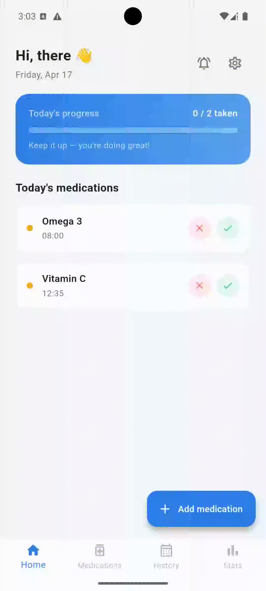

# Pillly

A full-stack medication reminder app — designed, built, and deployed end-to-end
across a 9-phase development process spanning product planning, system design,
backend API, Flutter mobile app, and automated push notification delivery.

*The name comes from "pill" + the repetitive suffix "-ly" — same pronunciation
in Korean and English, built with a global launch in mind.*

<table align="center">
  <tr>
    <td align="center"></td>
    <td align="center"></td>
    <td align="center"></td>
    <td align="center"></td>
  </tr>
  <tr>
    <td align="center">Home</td>
    <td align="center">Add & Edit</td>
    <td align="center">History Calendar</td>
    <td align="center">Stats</td>
  </tr>
</table>

<table align="center">
  <tr>
    <td align="center"></td>
  </tr>
  <tr>
    <td align="center"><strong>Notification</strong></td>
  </tr>
</table>

---

## Table of Contents

- [Why I built this](#why-i-built-this)
- [Features](#features)
- [What I built](#what-i-built)
- [How the notification pipeline works](#how-the-notification-pipeline-works)
- [Tech stack](#tech-stack)
- [Key decisions and what I learned](#key-decisions-and-what-i-learned)
- [Limitations](#limitations)
- [Development timeline](#development-timeline)
- **[Why did this fail](#why-did-this-fail)**
- **[So what I learned](#so-what-i-learned)**

---

## Why I built this

Medication non-adherence among chronic disease patients exceeds 50%.
The most common reason: simply forgetting.

Pillly addresses this with smart reminders, one-tap dose logging directly
from the lock screen, and visual adherence history — simple enough for elderly
users, reliable enough to actually build the habit.

---

## Features

| Feature | Detail |
|---|---|
| Medication management | Add medications with name, dosage, and color tag. Set a daily, weekly (specific days), or interval (every N days) schedule with up to 6 reminder times. |
| Smart reminders | Push notifications fire at the exact scheduled time. Respond with Taken ✓ or Skip ✗ directly from the lock screen — no app open required. |
| One-tap dose logging | Confirm or skip a dose from the home screen or the lock screen notification. Undo is available for today's logs. |
| Adherence calendar | Monthly calendar view with color-coded days: green (all done), yellow (partial), red (none). Tap any date to see per-medication details. |
| Statistics | Weekly and monthly adherence rates, broken down per medication with a bar chart. |
| Auth | Email sign-up / login, Google Sign-In, and Apple Sign-In. |
| Active / inactive toggle | Pause a medication without deleting it or losing its history. QStash schedules are removed on deactivate and re-registered on reactivate. |

---

## What I built

| | |
|---|---|
| [pillly-api](https://github.com/jinyoo1021/pillly-api) | Python / FastAPI backend — 18 REST endpoints across 5 domains, QStash-scheduled push notifications, CI/CD via GitHub Actions, deployed on Render |
| [pillly-app](https://github.com/jinyoo1021/pillly-app) | Flutter mobile app — iOS & Android, Riverpod state management, interactive lock-screen notifications with Taken ✓ / Skip ✗ action buttons |

[add image — screenshots: home, medication add, history calendar, stats]

---

## How the notification pipeline works

```
Flutter App (iOS / Android)
│ HTTPS
▼
FastAPI (Render)
├──→ Supabase PostgreSQL + Row-Level Security
└──→ Upstash QStash  ←  cron registered on medication save
        │
        │ fires signed JWT webhook at dose time
        ▼
     POST /v1/notifications/notify
        │
   ┌────┴────┐
  FCM      APNs
(Android)  (iOS)
        │
  [Taken ✓]  [Skip ✗]  on lock screen
        │ button tap — no app open needed
        ▼
  POST /dose/confirm  or  /dose/skip
        │
  dose_logs updated, UI syncs instantly
```

When a medication is added, the API registers a QStash cron job for each
scheduled time. At the right moment, QStash fires a signed JWT webhook back
to the server, which sends a data-only FCM message to the device. Flutter
intercepts the payload and renders a custom local notification with action
buttons — users confirm or skip without ever opening the app.

---

## Tech stack

| Layer | Technology |
|---|---|
| Mobile | Flutter 3, Riverpod 3, GoRouter |
| Backend | FastAPI (Python 3.11) |
| Database | Supabase (PostgreSQL + Row-Level Security) |
| Auth | Supabase Auth — email, Google Sign-In (native SDK), Apple Sign-In |
| Caching | Upstash Redis |
| Notification scheduling | Upstash QStash (cron-based webhook delivery) |
| Push notifications | Firebase Cloud Messaging (Android), APNs (iOS) |
| Error monitoring | Sentry |
| CI / CD | GitHub Actions → Docker → Render |

---

## Key decisions and what I learned

**Pivoting from AWS to a fully free stack**

The initial architecture used AWS ECS, RDS, ElastiCache, and ALB —
estimated at $196–250/month for a project with fewer than 10 daily users.
I redesigned around Render + Supabase + Upstash at $0/month while keeping
the codebase identical, so infrastructure can be swapped for AWS as scale
grows without touching application code.

| Scale | Stack | Est. cost |
|---|---|---|
| 0–100 users | Render free · Supabase free · Upstash free | $0 / month |
| 100–1,000 users | Render Starter · Supabase Pro | ~$20 / month |
| 1,000+ users | AWS ECS · RDS · ElastiCache · ALB | ~$150–250 / month |

---

**Separating public.users from auth.users in Supabase**

Referencing `auth.users` directly with a foreign key caused constraint
violations on every insert — Supabase manages `auth.users` separately from
the public schema. I created a `public.users` table that mirrors it and is
synced automatically on every sign-in, which also made future features like
caregiver accounts straightforward to design.

---

**Data-only FCM messages for interactive notifications**

When an FCM payload includes a `notification` field, Android auto-displays
a system notification that cannot have custom action buttons. Sending
data-only messages lets Flutter intercept the payload and render a fully
custom local notification with Taken ✓ / Skip ✗ buttons, keeping the
response flow entirely within the app.

---

**Background isolates and re-initialization**

Firebase background message handlers run in a separate Dart isolate.
Firebase, Supabase, and the local notifications plugin all need to be
re-initialized from scratch in that context. A shared `ProviderContainer`
passed from `main.dart` lets the handler invalidate Riverpod providers
from outside the widget tree, so the home screen refreshes after a
lock-screen action.

---

**QStash uses JWT signatures, not HMAC**

My first webhook verification used HMAC, which returned 401 on every
QStash call. QStash signs its webhooks with JWT, not HMAC. Replaced the
custom implementation with the official `qstash` Python SDK's `Receiver`
class, which resolved the issue immediately.

---

**Soft delete vs hard delete for schedules**

Dose logs hold foreign keys to schedule IDs, so hard-deleting a schedule
breaks history. When a medication's schedule changes, existing active
schedules are soft-deleted (`is_active = False`) and new ones are inserted.
Schedules with no dose_logs can be hard-deleted safely — the service checks
both cases before deciding which to apply.

---

**Timezone conversion for QStash cron expressions**

QStash cron jobs run in UTC, but users set reminder times in local time.
A 22:00 KST reminder must be registered as `0 13 * * *` in UTC — and times
before 09:00 KST wrap to the following day. Every schedule creation and update
runs a KST → UTC conversion utility before registering the cron. Getting this
wrong silently fires notifications at the wrong time with no error surfaced.

---

**Auth state timing: synchronous vs asynchronous providers**

The GoRouter redirect guard initially read auth state from a synchronous
`Provider<bool>` that resolved before Supabase had loaded the session from
secure storage — so every authenticated user was bounced to the login screen
on cold start. Replacing it with a provider backed by an `AsyncNotifier` that
emits only after session resolution fixed the loop. Anything that depends on
async initialization must be modeled as `AsyncValue`, not a plain synchronous
value.

---

**Optimistic UI with rollback**

Dose confirm and skip update the home screen immediately before the API call
completes. If the request fails, the provider rolls back to its previous state
and surfaces an error. This makes the app feel instant on slow connections
while keeping data consistent — the pattern is straightforward in Riverpod
but requires storing a snapshot of the previous state before any mutation.

---

**N+1 query in notification history**

The first version of the dose history endpoint fetched dose logs and then
issued a separate query per row to resolve the medication name — O(n) database
round-trips for a single screen load. Replacing it with a single JOIN query
eliminated the problem. The issue was invisible in local testing with small
datasets and only surfaced when thinking through production query counts.

---

## Limitations

- **QStash interval schedules** — QStash has no native "every N days" cron support. Interval medications are registered with daily crons and filtered server-side, which fires unnecessary webhook calls.
- **No offline support** — Dose logging requires an active network connection. Offline queuing was scoped out to keep the initial build achievable.
- **Single timezone assumption** — Schedules are stored and fired in the user's timezone at registration time. Traveling across timezones silently shifts reminder times.
- **FCM token lifecycle** — If a user reinstalls the app, the old FCM token becomes stale. The server has no mechanism to detect and prune dead tokens today.
- **Statistics granularity** — Weekly and monthly adherence rates are computed at request time with no caching, which will degrade as log history grows.

---

## Development timeline

9 phases from concept to deployed app:

| Phase | Description |
|---|---|
| 1–2 | Product spec, user personas, feature list, wireframes |
| 3–4 | System architecture (+ cost analysis), ERD, full API design |
| 5 | Dev environment — Docker, GitHub Actions CI/CD, DB migrations |
| 6 | Backend — 18 REST endpoints across auth, medications, schedules, dose, notifications |
| 7 | Flutter app — 13 screens, Riverpod providers, GoRouter, native social login |
| 8 | Testing (68 unit + widget tests), bug fixes, FCM integration |
| 9 | QStash auto-scheduling, JWT webhook verification, KST → UTC cron conversion, final deployment |

For the full engineering detail behind each phase, see the devlogs in [`devlog/`](https://jinyoo1021.notion.site/Pilly-Devlog-32759cb52c8b8064a87de9d5676856d8?source=copy_link).

---

## _Why did this fail_

It failed because the reliability requirements of a medication reminder app were higher than what my initial infrastructure and architecture could consistently guarantee.

**I optimized for $0 cost too early.**
I committed to a fully free stack from day one — Render, Supabase, and Upstash free tiers — with a planned upgrade path as users grew. In hindsight, free-tier constraints aren't just cost limits. They're reliability limits. Supabase pauses the database after 7 days of inactivity. QStash caps at 500 messages per day. Choosing this stack meant accepting those ceilings as operational realities before the product had proven it needed to exist.

**Render free-tier cold starts hurt time-critical notifications.**
Render's free plan sleeps after 15 minutes of inactivity. The architecture doc flagged this on day two and noted UptimeRobot pings as the mitigation — but that mitigation was never confirmed as running. QStash fires its webhook at exactly the scheduled time. A sleeping server adds a 20–30 second cold start before the notification can be sent. A late medication reminder is nearly as bad as no reminder at all.

**Free-tier limits became a product limit.**
QStash's daily message cap and other free-plan quotas made scale and consistency fragile even at small user counts. Interval schedules made this worse: because QStash has no native "every N days" support, I used daily triggers with server-side filtering. Filtered calls still consumed the daily quota, so interval users burned headroom without receiving a notification — accelerating the rate at which the cap became a real constraint.

**The notification path was too complex for the stage.**
`QStash → webhook → API auth / signature check → FCM / APNs → local notification / actions` — five hops, each capable of failing silently. A sleeping server, a paused database, a failed background isolate re-initialization, or a stale FCM token could each drop a notification with no signal to the user. Adding interactive lock-screen actions on top of this made the path more capable on paper and more fragile in practice.

**Token lifecycle and device-state handling were incomplete.**
Stale tokens after reinstall, single-device assumptions, and no token pruning strategy meant delivery reliability degraded over time without any visible signal. Firebase returns `registration-token-not-registered` for dead tokens, but the notification service had no handler — the failure was logged as delivered and ignored. A user who reinstalled the app would silently stop receiving reminders.

---

## _So what I learned_

**Cost optimization and reliability optimization are different problems.**
Choosing a free stack is a reasonable decision. Treating free-tier limits as problems to solve later — in a product where reliability is the core value — is not. The question I should have asked before choosing the infrastructure was not "how much does this cost" but "can this consistently guarantee the core feature."

**A documented risk with an unconfirmed mitigation is not a managed risk.**
The Render sleep issue was identified on day two and a mitigation was written down. But writing it down and confirming it works are different things. Recognizing a risk doesn't mean it's resolved. An unconfirmed mitigation silently accumulates as debt beneath every decision built on top of it.

**Pipeline complexity must match infrastructure reliability.**
A five-hop notification chain where any link can fail silently only makes sense when each layer offers strong reliability guarantees. Building that pipeline on free-tier services — each with its own sleep behavior, quota limit, and availability caveat — was a mismatch between the architecture's ambition and the infrastructure's guarantees. Complex structures only deliver complex value on a foundation that can be trusted.

**When infrastructure is the product, mock tests give false confidence.**
Mocking external services is the right approach for business logic. But when the product's value is a notification arriving on a real device at exactly the right time, tests that mock FCM and skip QStash signature verification aren't testing what matters. A green test suite is not the same as a working system.

**Prove the core loop first, then build everything else.**
The notification pipeline — the single feature the entire product depends on — was the last thing integrated and the least validated under real operating conditions. The right sequence would have been: prove that a real push notification arrives on a real device at the right time, then build the rest of the app on top of that verified foundation. The reliability of the core feature should be the first condition, not the last step.
